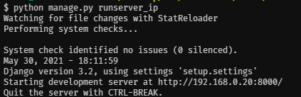
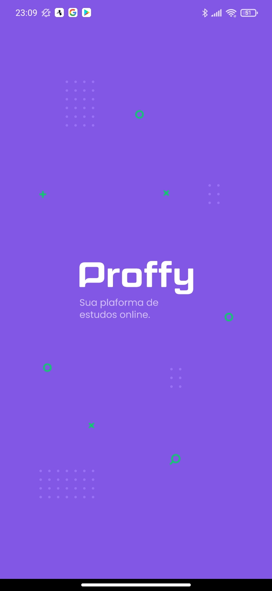
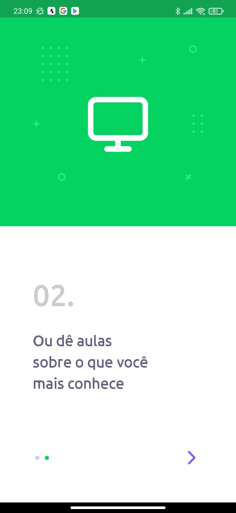
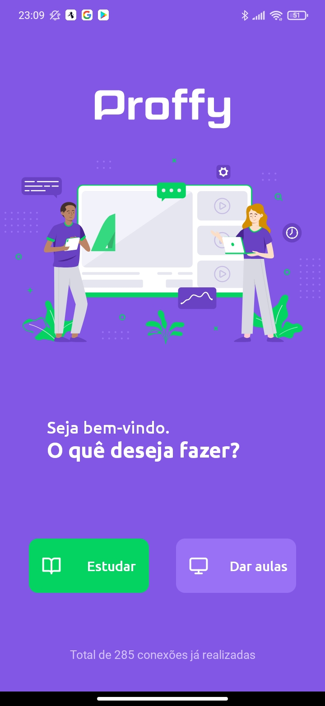
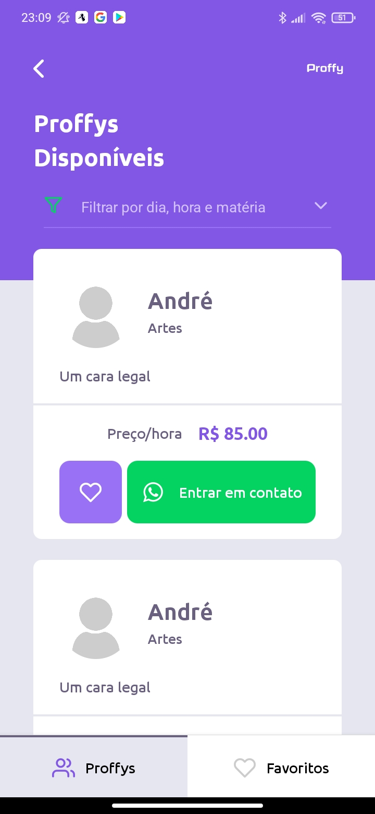

<h1 align="center">
    
</h1>

<h4 align="center">
  🚀 Next Level Week 2
</h4>


<p align="center">
  <a href="#-tecnologias">Tecnologias</a>&nbsp;&nbsp;&nbsp;|&nbsp;&nbsp;&nbsp;
  <a href="#-projeto">Projeto</a>&nbsp;&nbsp;&nbsp;|&nbsp;&nbsp;&nbsp;
  <a href="#instalação">Instalação</a>
</p>

## 🚀 Tecnologias

Esse projeto foi desenvolvido com as seguintes tecnologias:

- [Django](https://www.djangoproject.com/)
- [Django-Rest-Framework](https://www.django-rest-framework.org/)
- [Cloudinary](https://cloudinary.com/)
- [React](https://reactjs.org)
- [React Native](https://facebook.github.io/react-native/)
- [Expo](https://expo.io/)

## 💻 Projeto
**Proffy é uma plataforma de estudos online que deseja facilitar o contato entre professores disponíveis e alunos interessados.**

## Instalação
### Pré requisitos
Ter instalado:
- [Python](https://www.python.org/downloads/)
- [Node](https://nodejs.org/en/download/)
- [Yarn](https://classic.yarnpkg.com/en/docs/install/)

### Backend
#### Primeiro: renomear arquivo com variáveis de ambiente
-  **Renomear _backend/setup/env_example.py_ para _backend/setup/env.py_**

#### Segundo: no terminal, rodar
```sh
# Entrar na pasta dos arquivos do backend
cd backend

# Criar um ambiente virtual
python -m venv venv

# Ativar o ambiente virtual
. venv/Scripts/activate
# ou ./venv/bin/activate

# Instalar os pacotes necessários
pip install -r requirements.txt

# Executar as migrações
python manage.py migrate

# Carregar fixtures
python manage.py loaddata school_subjects

# Rodar backend
python runserver.py
```
<p align="center">
    
</p>

### OBS:
Usei o *Cloudinary* para salvar as imagens dos professores, mas não é necessário.

### Frontend
#### No terminal, rodar
```sh
# Entrar na pasta dos arquivos do frontend
cd web

# Instalar os pacotes necessários
yarn install

# Rodar
yarn start
```

<div align="center">
    
</div>
<p align="center">Home Page</p>
<hr>

<div align="center">
    
</div>
<p align="center">Student Page</p>
<hr>

<div align="center">
    
</div>
<p align="center">Teacher Page</p>
<hr>

### Mobile
#### No terminal, rodar
```sh
# Entrar na pasta dos arquivos do projeto mobile
cd mobile

# Instalar os pacotes necessários
yarn install

# Rodar
expo start
```

#### Terceiro: rodar expo no celular
- Abrir expo no celular
- Ler QR code e executar o app

<div align="center">
    
    
    
</div>
<p align="center">Splash Screen, On Boarding 1 and On Boarding 2</p>
<hr>

<div align="center">
    
    
    
</div>
<p align="center">Home, Be a Teacher and List Proffys</p>
<hr>

<div align="center">
    
</div>
<p align="center">Favorites</p>
<hr>